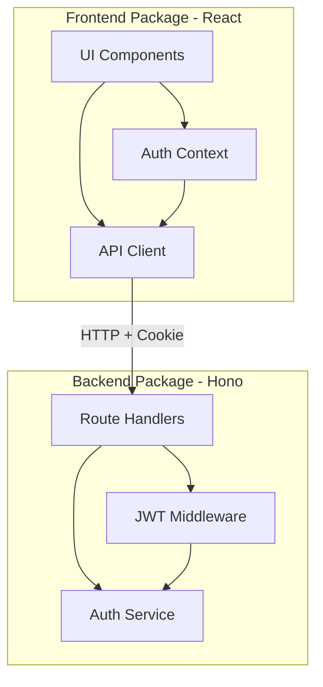
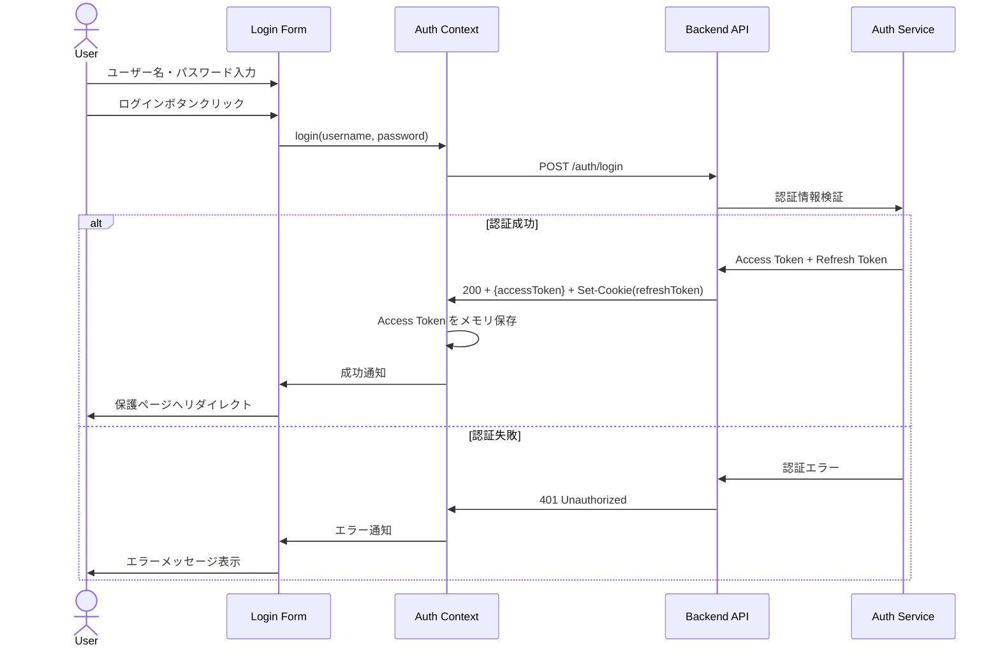
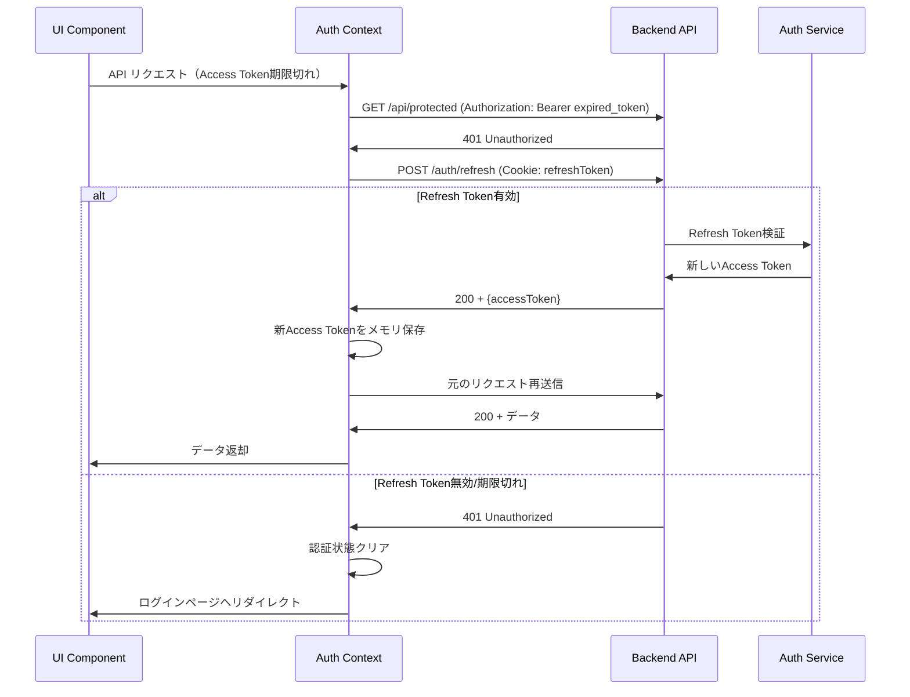
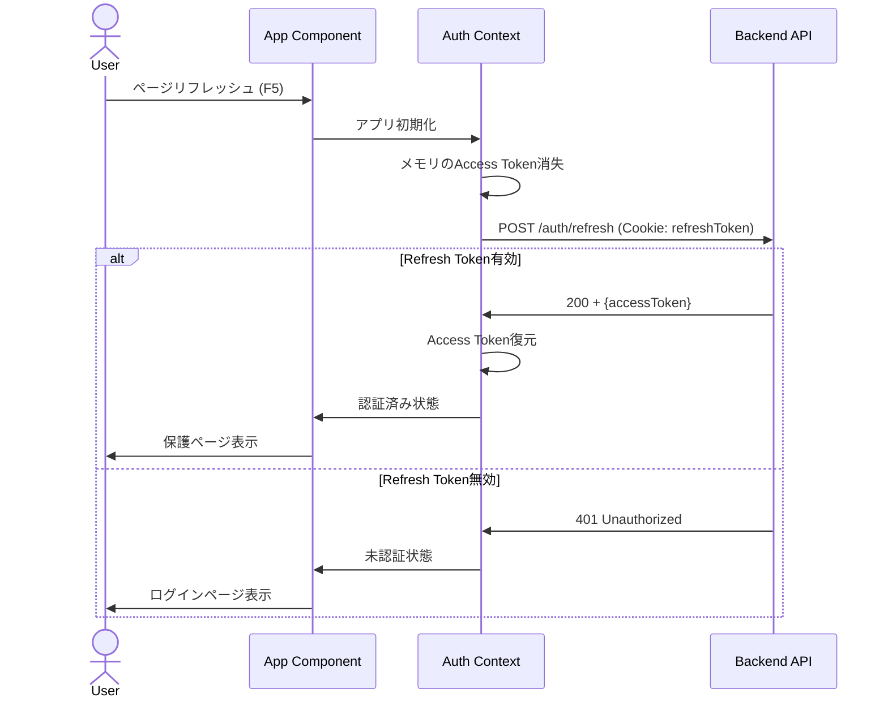

# Technical Design Document

## Overview

本機能は、アクセストークンとリフレッシュトークンによるJWT認証システムを、React+ViteフロントエンドとHonoバックエンドの分離構成で実装します。学習者がトークンベース認証の仕組みを理解し、実際に動作を確認できる最小限の実装を提供します。

**Purpose**: 学習者に対してJWT認証の基本フローを体験可能な環境を提供し、アクセストークンとリフレッシュトークンのライフサイクル管理パターンを実装を通じて理解させます。

**Users**: JWT認証を学習したい開発者、フロントエンド/バックエンド連携を理解したいエンジニア、トークン管理のベストプラクティスを習得したい学習者が主な対象です。

**Impact**: 既存のボイラープレート構成に認証機能を追加し、ログイン→保護リソースアクセス→トークンリフレッシュ→ログアウトの完全なフローを実現します。

### Goals

- ユーザー名/パスワードによるログイン機能の実装
- JWT（Access Token / Refresh Token）の発行と検証
- トークンの安全な保存戦略の実装（Access Token: メモリ、Refresh Token: HttpOnly Cookie）
- 自動トークンリフレッシュメカニズムの実装
- 保護されたAPIエンドポイントの実装
- React Context APIによる認証状態の集中管理
- 学習支援機能（トークン内容の可視化、デバッグログ）

### Non-Goals

- 本番環境レベルのセキュリティ実装（学習用途に焦点）
- データベース連携（ハードコードユーザーで十分）
- パスワードハッシュ化（bcryptなど、学習範囲外）
- MFA（多要素認証）
- OAuth/OIDC連携
- パスワードリセット機能
- ユーザー登録機能
- ロールベースアクセス制御（RBAC）
- 本番環境へのデプロイ設定

## Architecture

### Existing Architecture Analysis

現在のプロジェクト構成:
- **モノレポ構造**: pnpm workspace による `/pkgs/frontend` と `/pkgs/backend` の分離
- **フロントエンド**: React 19 + Vite、基本的なHello Worldコンポーネントのみ
- **バックエンド**: Hono、ポート3001で単一のGETエンドポイント (`/`) のみ
- **型安全性**: TypeScript使用、ESM構成
- **開発環境**: ローカル開発に最適化、Hot Module Replacement対応

既存パターンの踏襲:
- モノレポ構成を維持し、フロント/バック完全分離
- 各パッケージ内で`src/`配下に機能を追加
- 相対パスでのインポート（パスエイリアスなし）
- TypeScript strict modeの継続

### Architecture Pattern & Boundary Map

**Selected Pattern**: Layered Architecture（階層型アーキテクチャ）

**Rationale**:
- 学習用途に適したシンプルな構造
- フロント/バック分離と相性良好
- モノレポ構成と一致
- 各層の責務が明確で理解しやすい

**Domain Boundaries**:
- **Frontend Domain**: UI表示、ユーザー入力、認証状態管理、APIクライアント
- **Backend Domain**: JWT発行/検証、認証ミドルウェア、エンドポイント処理



**Key Decisions**:
- フロントエンドとバックエンドの通信はREST API（JSON）
- Refresh TokenはHttpOnly Cookieで自動送信
- Access Tokenは`Authorization: Bearer`ヘッダーで送信
- 認証ロジックはバックエンドに集約、フロントエンドは状態管理のみ

**Steering Compliance**:
- 既存のモノレポ構成を維持（`structure.md`準拠）
- TypeScript型安全性確保（`tech.md`準拠）
- 学習用途の最小構成維持（`product.md`準拠）

### Technology Stack

| Layer | Choice / Version | Role in Feature | Notes |
|-------|------------------|-----------------|-------|
| Frontend | React 19 | UI表示、認証状態管理 | 既存スタック、Context API使用 |
| Frontend | Vite | 開発サーバー、HMR | 既存スタック、ポート5173 |
| Frontend | React Bits |UIコンポーネント| UIコンポーネント |
| Frontend | jose ^5.x | JWT デコード | ESM対応、軽量、型安全 |
| Backend | Hono ^4.x | HTTP サーバー、ルーティング | 既存スタック、ポート3001 |
| Backend | @hono/node-server | Node.js アダプタ | 既存依存 |
| Backend | jose ^5.x | JWT 署名・検証 | 2026年推奨、ESM、Web標準準拠 |
| Runtime | Node.js (ESM) | 実行環境 | 既存スタック |
| Package Manager | pnpm 10.20.0 | 依存管理、workspace | 既存スタック |
| Language | TypeScript | 型安全性確保 | 既存スタック、`any`使用禁止 |

**Technology Decisions**:
- **jose**: jsonwebtokenより軽量で現代的、ESM対応、依存ゼロ（`research.md`参照）
- **Hono公式JWT middleware**: 使用しない（joseで統一し学習者が内部実装を理解できるようにする）
- **React Context API**: 追加依存なし、学習用途に十分な機能

## System Flows

### ログインフロー



### トークンリフレッシュフロー



### ページリフレッシュ時の認証状態復元



**Key Flow Decisions**:
- Access Token期限切れ時は自動的にリフレッシュを試行
- リフレッシュ失敗時はログインページへリダイレクト
- ページリロード時は起動時にリフレッシュエンドポイントを呼び出し

## Requirements Traceability

| Requirement | Summary | Components | Interfaces | Flows |
|-------------|---------|------------|------------|-------|
| 1.1 | ログインエンドポイント提供 | AuthController, AuthService | POST /auth/login | ログインフロー |
| 1.2 | 有効認証情報でトークン発行 | AuthService | AuthService.login() | ログインフロー |
| 1.3 | 無効認証情報で401返却 | AuthController | POST /auth/login | ログインフロー |
| 1.4 | Access Token有効期限設定 | AuthService | JWTPayload.exp | ログインフロー |
| 1.5 | Refresh Token有効期限設定 | AuthService | JWTPayload.exp | ログインフロー |
| 2.1 | トークン更新エンドポイント | AuthController | POST /auth/refresh | リフレッシュフロー |
| 2.2 | 有効Refresh Tokenで新Access Token発行 | AuthService | AuthService.refresh() | リフレッシュフロー |
| 2.3 | 無効Refresh Tokenで401返却 | AuthController | POST /auth/refresh | リフレッシュフロー |
| 2.4 | 新Access Tokenの有効期限リセット | AuthService | AuthService.refresh() | リフレッシュフロー |
| 3.1 | 保護エンドポイント提供 | ProtectedController | GET /api/protected | - |
| 3.2 | 有効Access Tokenでアクセス許可 | JWTMiddleware | jwtMiddleware() | - |
| 3.3 | 無効Access Tokenで401返却 | JWTMiddleware | jwtMiddleware() | - |
| 3.4 | Access Token未送信で401返却 | JWTMiddleware | jwtMiddleware() | - |
| 4.1 | ログインフォーム表示 | LoginForm | - | ログインフロー |
| 4.2 | ユーザー名・パスワード入力 | LoginForm | - | ログインフロー |
| 4.3 | ログインボタンでAPI送信 | LoginForm, AuthContext | login() | ログインフロー |
| 4.4 | ログイン成功でトークン保存 | AuthContext | login() | ログインフロー |
| 4.5 | ログイン失敗でエラー表示 | LoginForm | - | ログインフロー |
| 5.1 | Authorization Bearer自動付与 | apiClient | apiClient.fetch() | - |
| 5.2 | Access Token期限切れで自動更新 | AuthContext, apiClient | refresh() | リフレッシュフロー |
| 5.3 | Refresh Token期限切れでログイン画面 | AuthContext | - | リフレッシュフロー |
| 5.4 | ログアウト機能とトークン削除 | AuthContext | logout() | - |
| 6.1 | 認証成功後に保護ページ表示 | ProtectedPage, ProtectedRoute | - | - |
| 6.2 | 保護ページで保護APIからデータ取得 | ProtectedPage, apiClient | - | - |
| 6.3 | 取得データ表示 | ProtectedPage | - | - |
| 6.4 | 未認証時に保護ページブロック | ProtectedRoute | - | - |
| 7.1 | Access Token有効期限表示 | TokenDebugPanel | - | - |
| 7.2 | JWTペイロード表示 | TokenDebugPanel | - | - |
| 7.3 | デバッグモードでAPI通信ログ | apiClient | - | - |
| 8.1 | pnpm workspace構成維持 | - | - | - |
| 8.2 | フロント・バック別起動スクリプト | - | - | - |
| 8.3 | Frontend ポート5173起動 | - | - | - |
| 8.4 | Backend ポート3001起動 | - | - | - |
| 8.5 | 依存インストール後即起動可能 | - | - | - |

## Components and Interfaces

### Component Summary

| Component | Domain/Layer | Intent | Req Coverage | Key Dependencies (P0/P1) | Contracts |
|-----------|--------------|--------|--------------|--------------------------|-----------|
| AuthService | Backend / Service | JWT発行・検証ロジック | 1.2, 1.4, 1.5, 2.2, 2.4 | jose (P0) | Service |
| AuthController | Backend / Controller | 認証エンドポイント | 1.1, 1.3, 2.1, 2.3 | AuthService (P0) | API |
| JWTMiddleware | Backend / Middleware | トークン検証ミドルウェア | 3.2, 3.3, 3.4 | AuthService (P0) | - |
| ProtectedController | Backend / Controller | 保護リソース提供 | 3.1 | JWTMiddleware (P0) | API |
| AuthContext | Frontend / State | 認証状態管理 | 4.3, 4.4, 5.2, 5.3, 5.4 | apiClient (P0) | State |
| LoginForm | Frontend / UI | ログイン画面 | 4.1, 4.2, 4.5 | AuthContext (P0) | - |
| ProtectedRoute | Frontend / Routing | 認証ガード | 6.4 | AuthContext (P0) | - |
| ProtectedPage | Frontend / UI | 保護コンテンツ表示 | 6.1, 6.2, 6.3 | apiClient (P0) | - |
| TokenDebugPanel | Frontend / UI | トークン情報表示 | 7.1, 7.2 | AuthContext (P0), jose (P1) | - |
| apiClient | Frontend / Infra | HTTP通信ラッパー | 5.1, 7.3 | AuthContext (P1) | - |

### Backend Layer

#### AuthService

| Field | Detail |
|-------|--------|
| Intent | JWT署名・検証、ユーザー認証ロジックを提供 |
| Requirements | 1.2, 1.4, 1.5, 2.2, 2.4 |

**Responsibilities & Constraints**
- JWTの署名と検証を`jose`ライブラリで実施
- ユーザー認証情報の検証（学習用ハードコードユーザー）
- Access Token（15分）とRefresh Token（7日）の有効期限管理
- トークンペイロードの生成と検証
- 署名鍵はプロセス環境変数から取得

**Dependencies**
- External: jose — JWT署名・検証 (P0)

**Contracts**: [x] Service

##### Service Interface

```typescript
interface AuthService {
  /**
   * ユーザー認証とトークン発行
   * @throws AuthenticationError - 認証情報が無効
   */
  login(username: string, password: string): Promise<LoginResult>;

  /**
   * Refresh Tokenから新しいAccess Tokenを発行
   * @throws TokenExpiredError - Refresh Token期限切れ
   * @throws InvalidTokenError - トークンが無効
   */
  refresh(refreshToken: string): Promise<RefreshResult>;

  /**
   * Access Tokenを検証
   * @throws TokenExpiredError - トークン期限切れ
   * @throws InvalidTokenError - トークンが無効
   */
  verifyAccessToken(token: string): Promise<JWTPayload>;
}

interface LoginResult {
  accessToken: string;
  refreshToken: string;
  user: UserInfo;
}

interface RefreshResult {
  accessToken: string;
}

interface UserInfo {
  id: string;
  username: string;
}

interface JWTPayload {
  sub: string; // user id
  username: string;
  exp: number; // expiration timestamp
  iat: number; // issued at timestamp
}
```

- **Preconditions**:
  - login: username, password が空でない
  - refresh: refreshToken が有効な文字列
  - verifyAccessToken: token が有効な文字列
- **Postconditions**:
  - login: LoginResultを返却、または例外スロー
  - refresh: RefreshResultを返却、または例外スロー
  - verifyAccessToken: JWTPayloadを返却、または例外スロー
- **Invariants**:
  - JWT署名鍵は起動時に環境変数から読み込み、実行中不変
  - HS256アルゴリズム固定

**Implementation Notes**
- **Integration**: `jose`の`SignJWT`と`jwtVerify`を使用
- **Validation**: ユーザー認証は`username === 'demo' && password === 'password'`で簡易実装（学習用）
- **Risks**: 署名鍵が環境変数未設定時はエラー、起動時チェック必要

#### AuthController

| Field | Detail |
|-------|--------|
| Intent | 認証関連HTTPエンドポイントを提供 |
| Requirements | 1.1, 1.3, 2.1, 2.3 |

**Responsibilities & Constraints**
- `/auth/login` エンドポイントでログイン処理
- `/auth/refresh` エンドポイントでトークン更新
- Refresh TokenをHttpOnly Cookieで設定
- エラーハンドリングとHTTPステータスコード管理

**Dependencies**
- Inbound: Hono Router — ルーティング (P0)
- Outbound: AuthService — 認証ロジック (P0)

**Contracts**: [x] API

##### API Contract

| Method | Endpoint | Request | Response | Errors |
|--------|----------|---------|----------|--------|
| POST | /auth/login | LoginRequest | LoginResponse + Set-Cookie | 400, 401, 500 |
| POST | /auth/refresh | Cookie: refreshToken | RefreshResponse | 401, 500 |

```typescript
interface LoginRequest {
  username: string;
  password: string;
}

interface LoginResponse {
  accessToken: string;
  user: {
    id: string;
    username: string;
  };
}

interface RefreshResponse {
  accessToken: string;
}
```

**Set-Cookie Header (Refresh Token)**:
```
Set-Cookie: refreshToken=<jwt>; HttpOnly; Secure; SameSite=Strict; Path=/; Max-Age=604800
```

**Implementation Notes**
- **Integration**: Honoの`c.req.json()`でリクエストボディ取得、`c.cookie()`でCookie設定
- **Validation**: リクエストボディの必須フィールドチェック
- **Risks**: CORS設定が必要（フロント/バック異なるポート）

#### JWTMiddleware

| Field | Detail |
|-------|--------|
| Intent | 保護エンドポイントでAccess Token検証 |
| Requirements | 3.2, 3.3, 3.4 |

**Responsibilities & Constraints**
- `Authorization: Bearer <token>` ヘッダーからトークン抽出
- AuthService経由でトークン検証
- 検証成功時は`c.set('user', payload)`でユーザー情報をコンテキストに設定
- 検証失敗時は401レスポンス返却

**Dependencies**
- Inbound: Hono Middleware Chain — ミドルウェア適用 (P0)
- Outbound: AuthService — トークン検証 (P0)

**Contracts**: なし（Honoミドルウェア関数）

```typescript
/**
 * JWT認証ミドルウェア
 * Authorization: Bearer <token> ヘッダーを検証
 */
function jwtMiddleware(): MiddlewareHandler {
  return async (c, next) => {
    const authHeader = c.req.header('Authorization');

    if (!authHeader || !authHeader.startsWith('Bearer ')) {
      return c.json({ error: 'Unauthorized' }, 401);
    }

    const token = authHeader.substring(7);

    try {
      const payload = await authService.verifyAccessToken(token);
      c.set('user', payload);
      await next();
    } catch (error) {
      return c.json({ error: 'Invalid or expired token' }, 401);
    }
  };
}
```

**Implementation Notes**
- **Integration**: Honoのミドルウェアパターンに従う
- **Validation**: Authorizationヘッダー形式チェック
- **Risks**: なし

#### ProtectedController

| Field | Detail |
|-------|--------|
| Intent | 認証が必要な保護リソースを提供 |
| Requirements | 3.1 |

**Responsibilities & Constraints**
- `/api/protected` エンドポイントで保護データ返却
- JWTMiddleware適用必須
- コンテキストからユーザー情報取得

**Dependencies**
- Inbound: JWTMiddleware — 認証検証 (P0)

**Contracts**: [x] API

##### API Contract

| Method | Endpoint | Request | Response | Errors |
|--------|----------|---------|----------|--------|
| GET | /api/protected | Authorization: Bearer <token> | ProtectedResponse | 401, 500 |

```typescript
interface ProtectedResponse {
  message: string;
  user: {
    id: string;
    username: string;
  };
  timestamp: number;
}
```

**Implementation Notes**
- **Integration**: `app.get('/api/protected', jwtMiddleware(), handler)`でミドルウェア適用
- **Validation**: ミドルウェアで完了、ハンドラ内では不要
- **Risks**: なし

### Frontend Layer

#### AuthContext

| Field | Detail |
|-------|--------|
| Intent | アプリ全体の認証状態管理とトークン管理 |
| Requirements | 4.3, 4.4, 5.2, 5.3, 5.4 |

**Responsibilities & Constraints**
- Access Tokenをメモリ（React state）に保存
- ログイン、ログアウト、トークンリフレッシュ関数を提供
- 認証状態（`isAuthenticated`, `user`）を管理
- アプリ起動時に自動リフレッシュ実行

**Dependencies**
- Outbound: apiClient — HTTP通信 (P0)

**Contracts**: [x] State

##### State Management

```typescript
interface AuthContextValue {
  isAuthenticated: boolean;
  user: UserInfo | null;
  accessToken: string | null;
  login: (username: string, password: string) => Promise<void>;
  logout: () => void;
  refresh: () => Promise<void>;
}

interface UserInfo {
  id: string;
  username: string;
}
```

**State Model**:
- `accessToken`: メモリ保存、ページリフレッシュで消失
- `user`: ログインユーザー情報
- `isAuthenticated`: ログイン状態フラグ

**Persistence & Consistency**:
- Access Tokenはメモリのみ、永続化しない
- Refresh TokenはHttpOnly Cookieでブラウザとバックエンドが管理

**Concurrency Strategy**:
- リフレッシュ処理中は複数呼び出しを防ぐためフラグ管理

**Implementation Notes**
- **Integration**: React Context API + useState/useEffect
- **Validation**: login時にAPIレスポンスの型検証
- **Risks**: 同時リフレッシュ防止ロジックが必要

#### LoginForm

| Field | Detail |
|-------|--------|
| Intent | ログイン画面UIとフォーム処理 |
| Requirements | 4.1, 4.2, 4.5 |

**Responsibilities & Constraints**
- ユーザー名・パスワード入力フィールド表示
- ログインボタンクリックでAuthContext.login()呼び出し
- ログイン失敗時のエラーメッセージ表示
- フォームバリデーション（空欄チェック）

**Dependencies**
- Outbound: AuthContext — ログイン処理 (P0)

**Contracts**: なし（UIコンポーネント）

```typescript
interface LoginFormProps {
  onSuccess?: () => void;
}
```

**Implementation Notes**
- **Integration**: useAuthフックで認証コンテキストアクセス
- **Validation**: フロント側で空欄チェック、バックエンドで認証情報検証
- **Risks**: なし

#### ProtectedRoute

| Field | Detail |
|-------|--------|
| Intent | 認証ガードコンポーネント |
| Requirements | 6.4 |

**Responsibilities & Constraints**
- 認証状態をAuthContextから取得
- 未認証時はログインページへリダイレクト
- 認証済み時は子コンポーネントをレンダリング

**Dependencies**
- Inbound: React Router — ルーティング (P0)
- Outbound: AuthContext — 認証状態確認 (P0)

**Contracts**: なし（ルーティングコンポーネント）

```typescript
interface ProtectedRouteProps {
  children: React.ReactNode;
}
```

**Implementation Notes**
- **Integration**: React Router v6の`<Navigate>`でリダイレクト
- **Validation**: `isAuthenticated`フラグのみチェック
- **Risks**: なし

#### ProtectedPage

| Field | Detail |
|-------|--------|
| Intent | 認証後の保護コンテンツ表示 |
| Requirements | 6.1, 6.2, 6.3 |

**Responsibilities & Constraints**
- `/api/protected`エンドポイントからデータ取得
- 取得データを画面に表示
- ロード中状態とエラー状態の表示

**Dependencies**
- Outbound: apiClient — HTTP通信 (P0)

**Contracts**: なし（UIコンポーネント）

**Implementation Notes**
- **Integration**: useEffectでマウント時にデータ取得
- **Validation**: APIレスポンスの型検証
- **Risks**: なし

#### TokenDebugPanel

| Field | Detail |
|-------|--------|
| Intent | 学習支援用トークン情報表示パネル |
| Requirements | 7.1, 7.2 |

**Responsibilities & Constraints**
- Access Tokenの有効期限を表示
- JWTペイロードをデコードして表示
- デバッグモード時のみ表示

**Dependencies**
- Outbound: AuthContext — Access Token取得 (P0)
- External: jose — JWTデコード (P1)

**Contracts**: なし（UIコンポーネント）

```typescript
interface TokenDebugPanelProps {
  debugMode: boolean;
}
```

**Implementation Notes**
- **Integration**: `jose`の`decodeJwt()`でペイロードデコード（検証なし）
- **Validation**: トークン存在チェックのみ
- **Risks**: デバッグパネルを本番環境で表示しないよう注意

#### apiClient

| Field | Detail |
|-------|--------|
| Intent | HTTP通信の共通処理とトークン自動付与 |
| Requirements | 5.1, 7.3 |

**Responsibilities & Constraints**
- `Authorization: Bearer <token>`ヘッダー自動付与
- 401レスポンス時の自動リフレッシュ＆リトライ
- デバッグモード時のログ出力
- CORS対応

**Dependencies**
- Outbound: AuthContext — Access Token取得、リフレッシュ (P1)

**Contracts**: なし（ユーティリティ関数）

```typescript
interface ApiClientConfig {
  baseURL: string;
  debugMode: boolean;
}

interface ApiClient {
  get<T>(path: string): Promise<T>;
  post<T>(path: string, body: unknown): Promise<T>;
}
```

**Implementation Notes**
- **Integration**: fetchラッパー、AuthContext参照
- **Validation**: レスポンスステータスコードチェック
- **Risks**: 無限リフレッシュループ防止ロジック必要

## Data Models

### Domain Model

**Aggregates**:
- **User**: ユーザーエンティティ（学習用ハードコード）
- **JWT Token**: Access Token / Refresh Token（値オブジェクト）

**Entities**:
- User: id, username

**Value Objects**:
- JWTPayload: sub, username, exp, iat

**Business Rules**:
- Access Tokenは短命（15分）
- Refresh Tokenは長命（7日）
- 1ユーザーは1つのアクティブセッションのみ（本実装では未制限）

### Logical Data Model

**User Entity** (ハードコード):
```typescript
interface User {
  id: string;
  username: string;
  password: string; // 平文（学習用）
}
```

**JWT Payload**:
```typescript
interface JWTPayload {
  sub: string; // User ID
  username: string;
  exp: number; // Unix timestamp (秒)
  iat: number; // Unix timestamp (秒)
}
```

**Access Token**:
- 有効期限: 15分
- アルゴリズム: HS256
- 保存場所: フロントエンドメモリ

**Refresh Token**:
- 有効期限: 7日
- アルゴリズム: HS256
- 保存場所: HttpOnly Cookie

### Data Contracts & Integration

**API Data Transfer**:
- リクエスト/レスポンス: JSON
- Content-Type: application/json
- Authorization: Bearer <access_token>
- Cookie: refreshToken=<refresh_token>

**Serialization**:
- JWT: Compact Serialization (header.payload.signature)
- JSON: UTF-8エンコーディング

## Error Handling

### Error Strategy

各層でのエラーハンドリング方針:
- **Backend**: 例外スロー → Controllerでキャッチ → HTTPステータスコードとJSONエラー返却
- **Frontend**: try-catch → UIでエラーメッセージ表示

### Error Categories and Responses

**User Errors (4xx)**:
- **400 Bad Request**: リクエストボディが不正 → フィールド検証エラー表示
- **401 Unauthorized**: 認証失敗、トークン無効/期限切れ → ログインページへリダイレクト
- **404 Not Found**: エンドポイント不存在 → エラーページ表示

**System Errors (5xx)**:
- **500 Internal Server Error**: サーバー内部エラー → 一般的なエラーメッセージ表示、リトライ提案

**Business Logic Errors (422)**:
- 本実装では未使用（学習用途のため）

### Error Response Format

```typescript
interface ErrorResponse {
  error: string; // エラーメッセージ
  details?: unknown; // 詳細情報（オプション）
}
```

### Monitoring

- **Backend**: console.error()でエラーログ出力
- **Frontend**: デバッグモード時にconsole.log()でAPI通信ログ
- 本番環境向け監視ツールは導入しない（学習用途）

## Testing Strategy

### Unit Tests

**Backend**:
1. `AuthService.login()` - 有効/無効ユーザー認証
2. `AuthService.refresh()` - 有効/無効Refresh Token処理
3. `AuthService.verifyAccessToken()` - トークン検証ロジック
4. JWT署名・検証の正確性
5. トークン有効期限計算

**Frontend**:
1. `AuthContext.login()` - ログイン成功/失敗処理
2. `AuthContext.refresh()` - リフレッシュ成功/失敗処理
3. `useAuth` hook - 認証状態取得
4. `apiClient` - Authorization ヘッダー付与
5. `ProtectedRoute` - リダイレクトロジック

### Integration Tests

**Backend**:
1. POST /auth/login → トークン発行 → Cookie設定確認
2. POST /auth/refresh → 新Access Token発行確認
3. GET /api/protected → JWTMiddleware → 認証済みレスポンス
4. 無効トークンでのアクセス拒否確認
5. CORS設定の動作確認

**Frontend**:
1. ログインフォーム送信 → AuthContext更新 → Protected Pageリダイレクト
2. Protected Page表示 → /api/protected呼び出し → データ表示
3. トークン期限切れ → 自動リフレッシュ → リクエスト成功
4. リフレッシュ失敗 → ログインページリダイレクト
5. ログアウト → 認証状態クリア → ログインページ表示

### E2E Tests

1. ユーザーログイン → 保護ページアクセス → データ表示確認
2. ページリフレッシュ → 認証状態維持確認
3. Access Token期限切れ → 自動リフレッシュ → 継続利用確認
4. ログアウト → 保護ページアクセス不可確認
5. トークンデバッグパネル表示 → ペイロード確認

## Security Considerations

### Threat Modeling

- **XSS攻撃**: Refresh TokenをHttpOnly Cookieに保存し、JavaScriptからアクセス不可にする
- **CSRF攻撃**: `SameSite=Strict`フラグで緩和
- **中間者攻撃**: 本番環境ではHTTPS必須（学習環境ではHTTP許容）
- **トークンリプレイ攻撃**: 短いAccess Token有効期限で緩和

### Security Controls

**Token Storage**:
- Access Token: メモリ（React state）
- Refresh Token: HttpOnly Cookie with Secure, SameSite=Strict

**CORS Configuration**:
```typescript
app.use('/*', cors({
  origin: 'http://localhost:5173',
  credentials: true,
}));
```

**JWT Signing**:
- アルゴリズム: HS256
- 署名鍵: 環境変数 `JWT_SECRET`（最低32文字）

### Data Protection

- パスワード: 平文保存（学習用、本番環境では絶対禁止）
- JWT Payload: 機密情報を含めない（公開情報のみ）
- HTTPS: 本番環境では必須

### Compliance

本学習プロジェクトでは以下を意図的に簡略化:
- パスワードハッシュ化（bcryptなど）未実装
- データベース永続化未実装
- ログ監査未実装

## Performance & Scalability

### Target Metrics

学習用途のため厳密な性能目標なし:
- API レスポンスタイム: < 100ms (ローカル環境)
- フロントエンド初期ロード: < 2秒

### Optimization Techniques

**Backend**:
- JWT検証はインメモリ（DB不要）
- ステートレス設計（水平スケール可能、ただし本実装では不要）

**Frontend**:
- Access Tokenをメモリ保存（高速アクセス）
- 不要な再レンダリング防止（useMemo, useCallback）

## Supporting References

なし（設計内容は本ドキュメントで完結）
