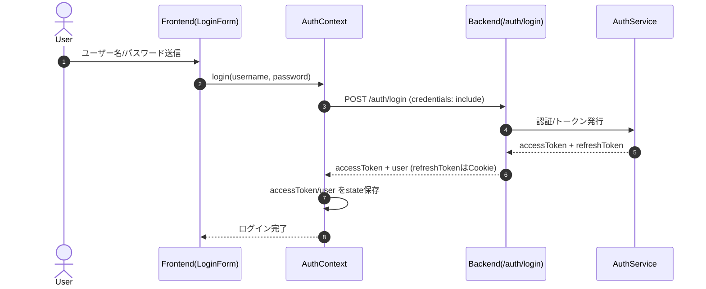
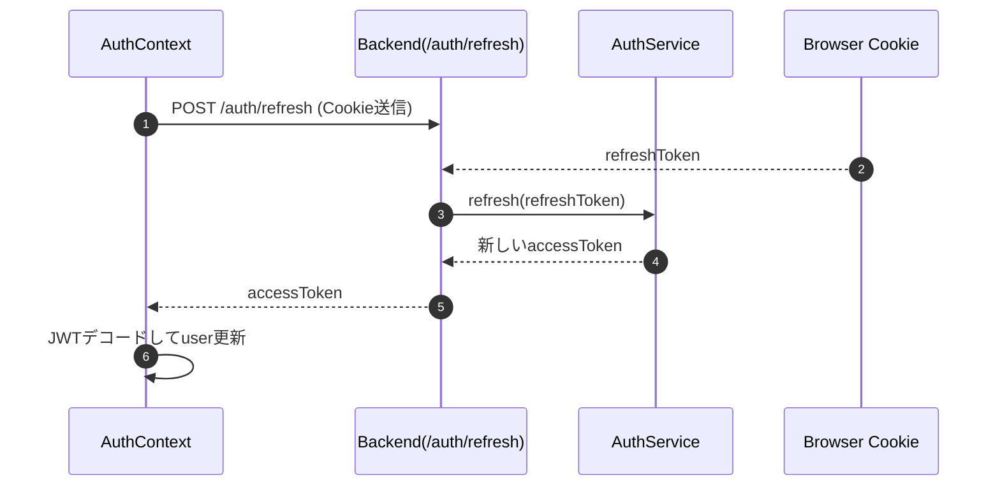
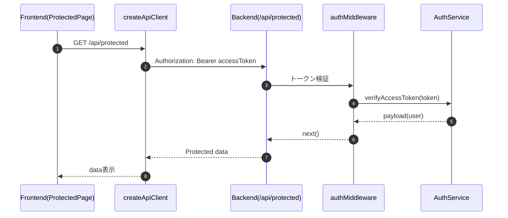
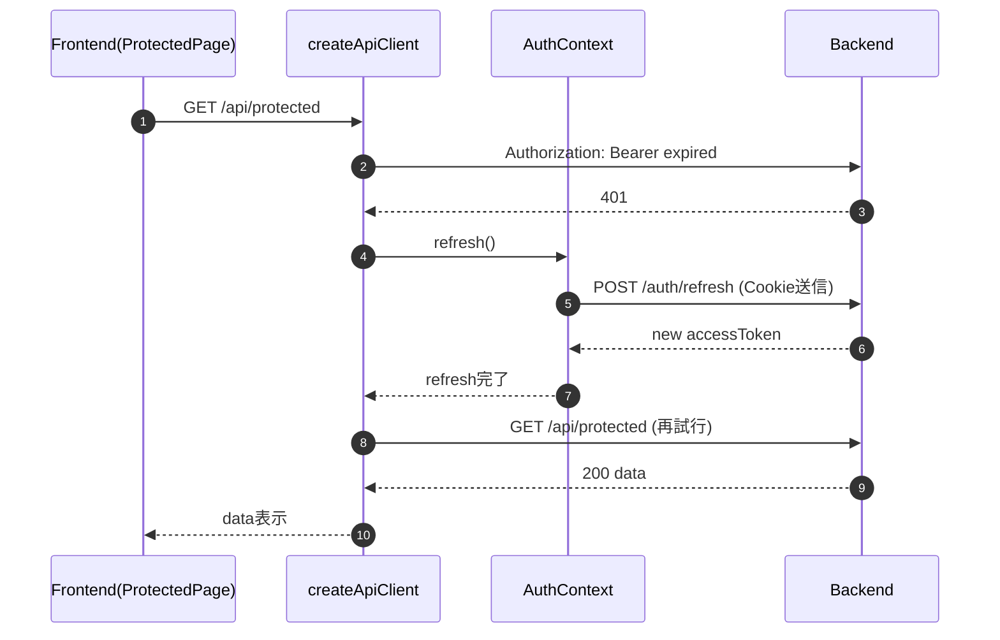
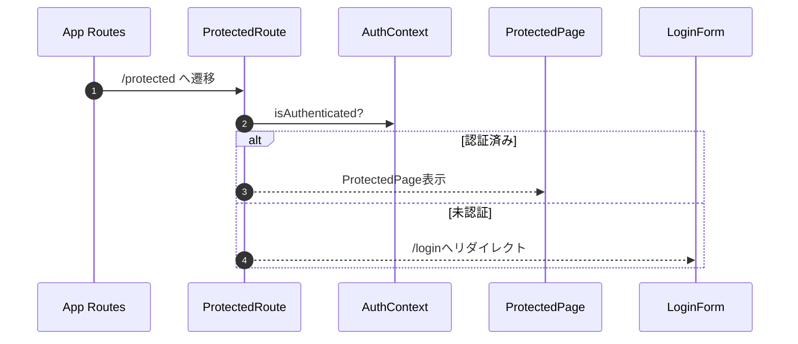
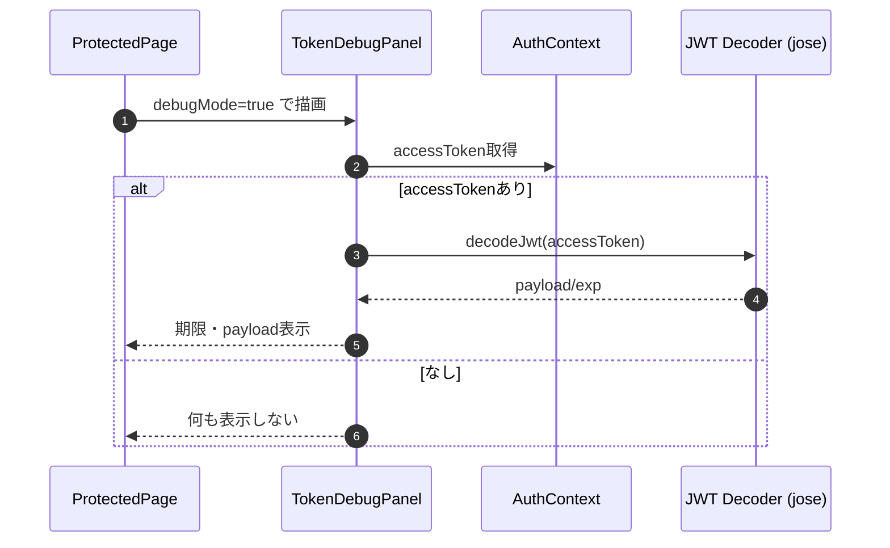
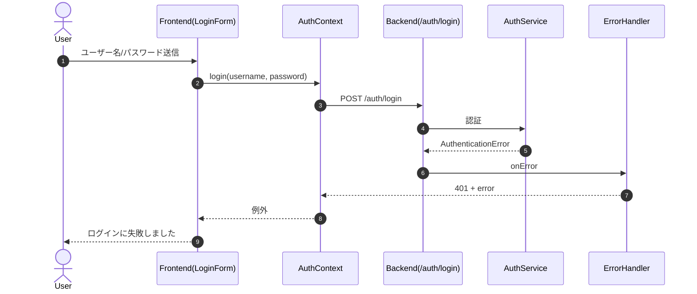
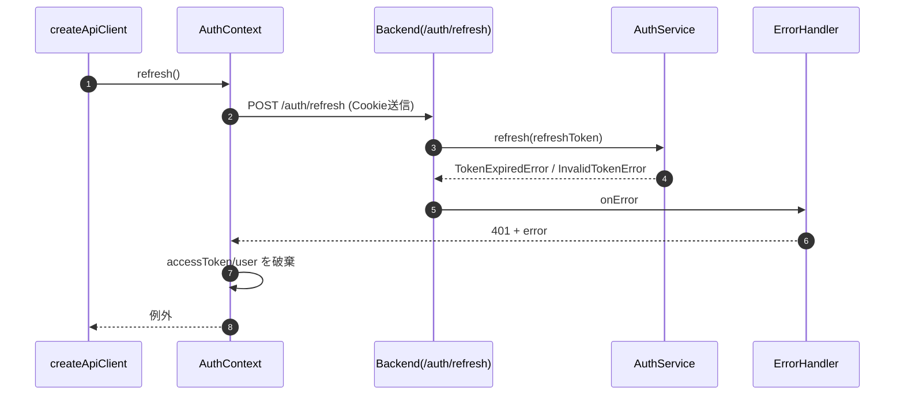
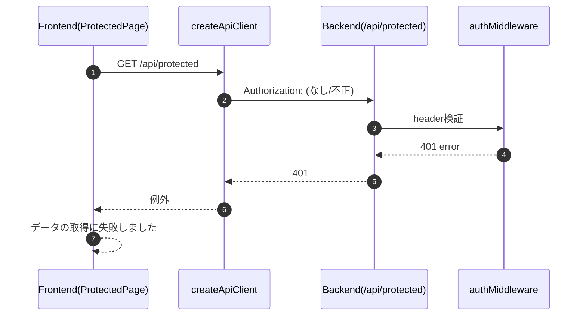

# accesstoken-sample

React + Honoで開発するアクセストークン、リフレッシュトークン学習用のプロジェクト

## 概要

アクセストークン、リフレッシュトークンの仕組みを学習するためのサンプルプロジェクトです。

フロントエンドはReact + Vite、バックエンドは Honoで構築しています。

## システム概要

- 目的: アクセストークン/リフレッシュトークンの仕組みを学習するためのサンプル
- フロントエンド: React + Vite + TypeScript
- バックエンド: Hono + Node.js + TypeScript
- 認証方式: Access Tokenはレスポンスで返却、Refresh TokenはHttpOnly Cookieで保持

## 機能一覧

1. ログイン（/auth/login）
2. アクセストークンのリフレッシュ（/auth/refresh）
3. 保護リソース取得（/api/protected）
4. 401時の自動リトライ（フロントのAPIクライアント）
5. 認可ガードとルーティング（ProtectedRoute/App）
6. トークンデバッグ表示（TokenDebugPanel, devのみ）

## 処理シーケンス図

### ログイン



### アクセストークンのリフレッシュ



### 保護リソース取得



### 401時の自動リトライ



### 認可ガードとルーティング



### トークンデバッグ表示（devのみ）



### ログイン失敗（認証エラー）



### リフレッシュ失敗（トークン不正/期限切れ）



### 保護リソース取得失敗（Authorizationヘッダ不正）



## 動かし方

### インストール

```bash
pnpm i
```

### フロントエンドの起動

```bash
pnpm frontend dev
```

### バックエンドサーバーの起動

```bash
pnpm backend dev
```

アクセストークンの検証に成功した時のログ

```bash
Verified access token payload: {
  sub: 'user-demo-001',
  username: 'demo',
  iat: 1768794320,
  exp: 1768795220
}
```

## 参考文献
- [JWT Decorder](https://www.jwt.io/ja)
